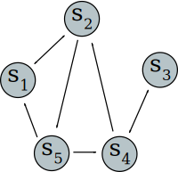
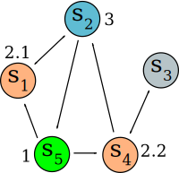

+++
title = "Graphs"
date = 2017-06-02
updated = 2017-06-02
[taxonomies]
category = ["algos"]
tags = ["graphs"]
+++

<noscript>There are a few things which won't render unless you enable
JavaScript. No tracking, I promise!</noscript>

> Don't know English? [Read the Spanish version instead](spanish.html).

  
Let's imagine we have 5 bus stations, which we'll denote by \(s_i\):

  \(\begin{bmatrix}
  & s_1 & s_2 & s_3 & s_4 & s_5 \\
  s_1   &   & V &   &   &       \\
  s_2   & V &   &   &   & V     \\
  s_3   &   &   &   & V &       \\
  s_4   &   & V & V &   &       \\
  s_5   & V &   &   & V &
 \end{bmatrix}\)

  
This is known as a <i>"table of direct interconnections"</i>.

  
The \(V\) represent connected paths. For instance, on the first
  row starting at \(s_1\), reaching the \(V\),
  allows us to turn up to get to \(s_2\).

  
We can see the above table represented in a more graphical way:

  
  
This type of graph is called, well, a <i>graph</i>, and it's a directed
  graph (or <i>digraph</i>), since the direction on which the arrows go does
  matter. It's made up of vertices, joined together by edges (also known as
  lines or directed <b>arcs</b>).

  
One can walk from a node to another through different <b>paths</b>. For
  example, \(s_4 \rightarrow s_2 \rightarrow s_5\) is an indirect path of <b>order</b>
  two, because we must use two edges to go from \(s_4\) to
  \(s_5\).

  
Let's now represent its adjacency matrix called A which represents the
  same table, but uses <mark>1</mark> instead </mark>V</mark> to represent
  a connection:

  \(\begin{bmatrix}
    0 & 1 & 0 & 0 & 0 \\
    1 & 0 & 0 & 0 & 1 \\
    0 & 0 & 0 & 1 & 0 \\
    0 & 1 & 1 & 0 & 0 \\
    1 & 0 & 0 & 1 & 0
\end{bmatrix}\)

  
This way we can see how the \(a_{2,1}\) element represents the
  connection \(s_2 \rightarrow s_1\), and the \(a_{5,1}\) element the
  \(s_5 \rightarrow s_1\) connection, etc.

  
In general, \(a_{i,j}\) represents a connection from
    \(s_i \rightarrow s_j\)as long as \(a_{i,j}\geq 1\).

  
Working with matrices allows us to have a computable representation of
  any graph, which is very useful.

  

  
Graphs have a lot of interesting properties besides being representable
  by a computer. What would happen if, for instance, we calculated
  \(A^2\)? We obtain the following matrix:

  \(\begin{bmatrix}
  1 & 0 & 0 & 0 & 1 \\
  1 & 1 & 0 & 1 & 0 \\
  0 & 1 & 1 & 0 & 0 \\
  1 & 0 & 0 & 1 & 1 \\
  0 & 2 & 1 & 0 & 0
  \end{bmatrix}\)

  
We can interpret this as the paths of order <b>two</b>.

  
But what does the element \(a_{5,2}=2\) represent? It indicates
  the amount of possible ways to go from  \(s_5 \rightarrow s_i \rightarrow s_2\).

  
One can manually multiply the involved row and column to determine which
  element is the one we need to pass through, this way we have the row
  \([1 0 0 1 0]\) and the column \([1 0 0 1 0]\) (on
  vertical). The elements \(s_i\geq 1\) are \(s_1\) and
  \(s_4\). This is, we can go from \(s_5\) to
  \(s_2\) via \(s_5 \rightarrow s_1 \rightarrow s_2\) or via
  \(s_5 \rightarrow s_4 \rightarrow s_2\):

  

  
It's important to note that graphs to not consider self-connections, this
  is, \(s_i \rightarrow s_i\) is not allowed; neither we work with multigraphs
  here (those which allow multiple connections, for instance, an arbitrary
  number \(n\) of times).

  \(\begin{bmatrix}
  1 & 1 & 0          & 1 & 0 \\
  1 & 2 & \textbf{1} & 0 & 1 \\
  1 & 0 & 0          & 1 & 1 \\
  1 & 2 & 1          & 1 & 0 \\
  2 & 0 & 0          & 1 & 2
  \end{bmatrix}\)

  
We can see how the first \(1\) just appeared on the element
    \(a_{2,3}\), which means that the shortest path to it is at least
  of order three.</mark>

  

  
A graph is said to be <b>strongly connected</b> as long as there is a
  way to reach <i>all</i> its elements.

  
We can see all the available paths until now by simply adding up all the
  direct and indirect ways to reach a node, so for now, we can add
  \(A+A^2+A^3\) in such a way that:

  \(\begin{bmatrix}
  2 & 2 & 0 & 1 & 1 \\
  3 & 3 & 1 & 1 & 3 \\
  1 & 1 & 1 & 2 & 1 \\
  2 & 3 & 2 & 2 & 1 \\
  3 & 2 & 1 & 2 & 2
  \end{bmatrix}\)

  
There isn't a connection between \(s_1\) and \(s_3\) yet.
  If we were to calculate \(A^4\):

  \(\begin{bmatrix}
  1 & 2 & 1 &   &   \\
    &   &   &   &   \\
    &   &   &   &   \\
    &   &   &   &   \\
    &   &   &   &
  \end{bmatrix}\)

  
We don't need to calculate anymore. We now know that the graph is
  strongly connected!

  

  
Congratulations! You've completed this tiny introduction to graphs.
  Now you can play around with them and design your own connections.

  
Hold the left mouse button on the above area and drag it down to create
  a new node, or drag a node to this area to delete it.

  
To create new connections, hold the right mouse button on the node you
  want to start with, and drag it to the node you want it to be connected to.

  
To delete the connections coming from a specific node, middle click it.

  <table><tr><td style="width:100%;">
    <button onclick="resetConnections()">Reset connections</button>
    <button onclick="clearNodes()">Clear all the nodes</button>
     
     
    <label for="matrixOrder">Show matrix of order:</label>
    <input id="matrixOrder" type="number" min="1" max="5"
                            value="1" oninput="updateOrder()">
     
    <label for="matrixAccum">Show accumulated matrix</label>
    <input id="matrixAccum" type="checkbox" onchange="updateOrder()">
     
     
    

      <table id="matrixTable"></table>
    

  </td><td>
    <canvas id="canvas" width="400" height="400" oncontextmenu="return false;">
    Looks like your browser won't let you see this fancy example :(
    </canvas>
     
  </td></tr></table>

