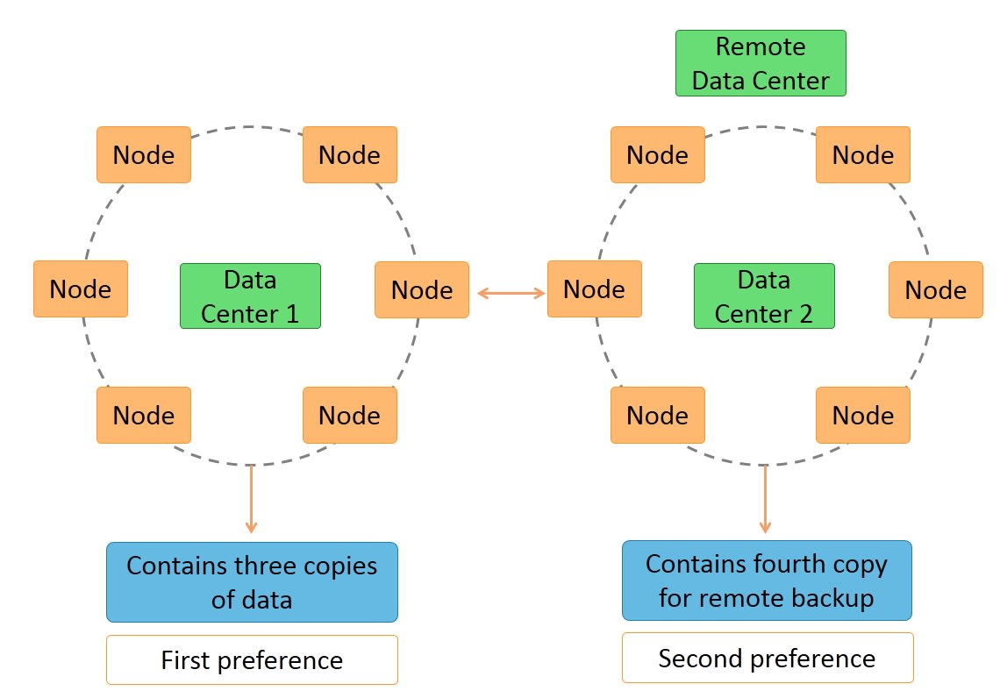

```meta
title: Cassandra: Introducción
published: 2020-03-05T00:00:33+00:00
updated: 2020-03-30T09:28:07+00:00
```


Este es el primer post en la serie sobre Cassandra, en el cuál introduciremos dicha bases de datos NoSQL y veremos sus características e instalación.

Otros posts en esta serie:

* [Cassandra: Introducción](/blog/mdad/cassandra-introduccion/) (este post)
* [Cassandra: Operaciones Básicas y Arquitectura](/blog/mdad/cassandra-operaciones-basicas-y-arquitectura/)

Este post está hecho en colaboración con un compañero.

----------

## Finalidad de la tecnología

Apache Cassandra es una base de datos NoSQL distribuida y de código abierto ([con un espejo en GitHub](https://github.com/apache/cassandra)). Su filosofía es de tipo «clave-valor», y puede manejar grandes volúmenes de datos

Entre sus objetivos, busca ser escalable horizontalmente (puede replicarse en varios centros manteniendo la latencia baja) y alta disponibilidad sin ceder en rendimiento.

## Cómo funciona

Instancias de Cassandra se distribuyen en nodos iguales (es decir, no hay maestro-esclavo) que se comunican entre sí (P2P). De este modo, da buen soporte entre varios centros de datos, con redundancia y réplicas síncronas.



Con respecto al modelo de datos, Cassandra particiona las filas con el objetivo de re-organizarla a lo largo distintas tablas. Como clave primaria, se usa un primer componente conocido como «clave de la partición». Dentro de cada partición, las filas se agrupan según el resto de columnas de la clave. Cualquier otra columna se puede indexar independientemente de la clave primaria.

Las tablas se pueden crear, borrar, actualizar y consultar sin bloqueos. No hay soporte para JOIN o subconsultas, pero Cassandra prefiere de-normalizar los datos haciendo uso de características como coleciones.

Para realizar las operaciones sobre cassandra se usa CQL (Cassandra Query Language), que tiene una sintaxis muy similar a SQL.

## Características

Como ya hemos mencionado antes, la arquitectura de Cassandra es **decentralizada**. No tiene un único punto que pudiera fallar porque todos los nodos son iguales (sin maestros), y por lo tanto, cualquiera puede dar servicio a la petición.

Los datos se encuentran **replicados** entre los distintos nodos del clúster (lo que ofrece gran **tolerancia a fallos** sin necesidad de interrumpir la aplicación), y es trivial **escalar** añadiendo más nodos al sistema.

El nivel de **consistencia** para lecturas y escrituras es configurable.

Siendo de la familia Apache, Cassandra ofrece integración con Apache Hadoop para tener soporte MapReduce.

## Arista dentro del Teorema CAP

Cassandra se encuentra dentro de la esquina «AP» junto con CouchDB y otros, porque garantiza tanto la disponibilidad como la tolerancia a fallos.

Sin embargo, puede configurarse como un sistema «CP» si se prefiere respetar la consistencia en todo momento.


## Descarga

Se pueden seguir las instrucciones de la página oficial para [descargar Cassandra](https://cassandra.apache.org/download/). Para ello, se debe clicar en la [última versión para descargar el archivo](https://www.apache.org/dyn/closer.lua/cassandra/3.11.6/apache-cassandra-3.11.6-bin.tar.gz). En nuestro caso, esto es el enlace nombrado «3.11.6», versión que utilizamos.

## Instalación

Cassandra no ofrece binarios para Windows, por lo que usaremos Linux para instalarlo. En nuestro caso, tenemos un sistema Linux Mint (derivado de Ubuntu), pero una máquina virtual con cualquier Linux debería funcionar.

Debemos asegurarnos de tener Java y Python 2 instalado mediante el siguiente comando:

```
apt install openjdk-8-jdk openjdk-8-jre python2.7
```

Para verificar que la instalación ha sido correcta, podemos mostrar las versiones de los programas:

```
$ java -version
openjdk version "1.8.0_242"
OpenJDK Runtime Environment (build 1.8.0_242-8u242-b08-0ubuntu3~18.04-b08)
OpenJDK 64-Bit Server VM (build 25.242-b08, mixed mode)

$ python2 --version
Python 2.7.17
```

Una vez las dependencias estén instaladas, extraemos el fichero descargado o bien mediante la interfaz gráfica de nuestro sistema, o bien mediante un comando:

```
tar xf apache-cassandra-3.11.6-bin.tar.gz
```

Y finalmente, lanzar la ejecución de Cassandra:

```
apache-cassandra-3.11.6/bin/cassandra
```

Es posible que tarde un poco en abrirse, pero luego debería haber muchas líneas de log indicando. Para apagar el servidor, simplemente basta con pulsar `Ctrl+C`.

## Referencias

* [Apache Cassandra Architecture Fundamentals – The Distributed SQL Blog](https://blog.yugabyte.com/apache-cassandra-architecture-how-it-works-lightweight-transactions/)
* [Apache Cassandra](https://cassandra.apache.org/)
* [How Apache Cassandra™ Balances Consistency, Availability, and Performance – Datasax](https://www.datastax.com/blog/2019/05/how-apache-cassandratm-balances-consistency-availability-and-performance)
* [Apache Cassandra Architecture Fundamentals](https://blog.yugabyte.com/apache-cassandra-architecture-how-it-works-lightweight-transactions/)
