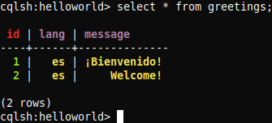

+++
title = "Cassandra: Operaciones Básicas y Arquitectura"
date = 2020-03-05T02:00:41+00:00
updated = 2020-03-20T11:36:18+00:00
+++
Este es el segundo post en la serie sobre Cassandra, con una breve descripción de las operaciones básicas (tales como inserción, recuperación e indexado), y ejecución por completo junto con el modelo de datos y arquitectura.

Otros posts en esta serie:

* [Cassandra: Introducción](/blog/mdad/cassandra-introduccion/)
* [Cassandra: Operaciones Básicas y Arquitectura](/blog/mdad/cassandra-operaciones-basicas-y-arquitectura/) (este post)

Este post está hecho en colaboración con un compañero.

----------

Antes de poder ejecutar ninguna consulta, debemos lanzar la base de datos en caso de que no se encuentre en ejecución aún. Para ello, en una terminal, lanzamos el binario de `cassandra`:

```
$ cassandra-3.11.6/bin/cassandra
```

Sin cerrar esta consola, abrimos otra en la que podamos usar la [CQL shell](https://cassandra.apache.org/doc/latest/tools/cqlsh.html):

```
$ cassandra-3.11.6/bin/cqlsh
Connected to Test Cluster at 127.0.0.1:9042.
[cqlsh 5.0.1 | Cassandra 3.11.6 | CQL spec 3.4.4 | Native protocol v4]
Use HELP for help.
cqlsh>
```

## Crear

### Crear una base de datos

Cassandra denomina a las «bases de datos» como «espacio de claves» (keyspace en inglés).

```
cqlsh> create keyspace helloworld with replication = {'class': 'SimpleStrategy', 'replication_factor': 3};
```

Cuando creamos un nuevo _keyspace_, indicamos el nombre y la estrategia de replicación a usar. Nosotros usamos la estrategia simple con un factor 3 de replicación.

### Crear una tabla

Una vez estemos dentro de un _keyspace_, podemos crear tablas. Vamos a crear una tabla llamada «greetings» con identificador (número entero), mensaje (texto) y lenguaje (`varchar`).

```
cqlsh> use helloworld;
cqlsh:helloworld> create table greetings(id int primary key, message text, lang varchar);
```

### Crear una fila

Insertar nuevas filas es similar a otros sistemas gestores de datos, mediante la sentencia `INSERT`:

```
cqlsh:helloworld> insert into greetings(id, message, lang) values(1, '¡Bienvenido!', 'es');
cqlsh:helloworld> insert into greetings(id, message, lang) values(2, 'Welcome!', 'es');
```

## Leer

La lectura se lleva a cabo mediante la sentencia `SELECT`:

```
cqlsh:helloworld> select * from greetings;

 id | lang | message
----+------+--------------
  1 |   es | ¡Bienvenido!
  2 |   es |     Welcome!

(2 rows)
```

`cqlsh` colorea la salida, lo cuál resulta muy útil para identificar la clave primaria y distintos tipos de datos como texto, cadenas o números:



## Actualizar

La actualización se lleva a cabo con la sentencia `UPDATE`. Vamos a arreglar el fallo que hemos cometido al insertar «Welcome!» como español:

```
cqlsh:helloworld> update greetings set lang = 'en' where id = 2;
```

## Indexar

```
cqlsh:helloworld> create index langIndex on greetings(lang);
```

## Borrar

Finalmente, el borrado se lleva a cabo con la sentencia `DELETE`. Es posible borrar solo campos individuales, lo cuál los pone a nulos:

```
cqlsh:helloworld> delete message from greetings where id = 1;
```

Para eliminar la fila entera, basta con no especificar la columna:

```
cqlsh:helloworld> delete from greetings where id = 1;
```

## Referencias

* [tutorialspoint – Creating a Keyspace using Cqlsh](https://www.tutorialspoint.com/cassandra/cassandra_create_keyspace.htm)
* [tutorialspoint – Cassandra – CQL Datatypes](https://www.tutorialspoint.com/cassandra/cassandra_cql_datatypes.htm)
* [tutorialspoint – Cassandra – Create Table](https://www.tutorialspoint.com/cassandra/cassandra_create_table.htm)
* [Data Flair – Cassandra Crud Operation – Create, Update, Read & Delete](https://data-flair.training/blogs/cassandra-crud-operation/)
* [Cassandra Documentation – Secondary Indexes](https://cassandra.apache.org/doc/latest/cql/indexes.html)