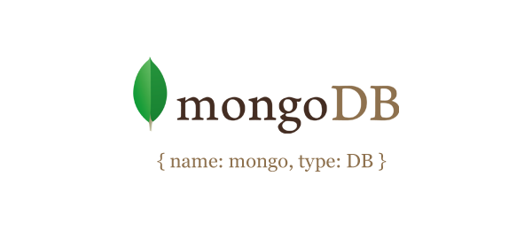
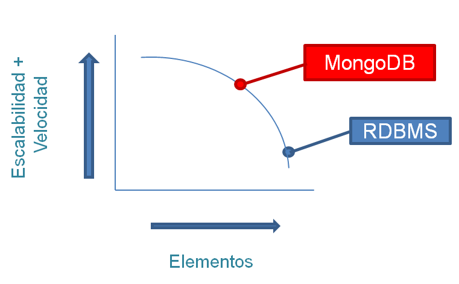
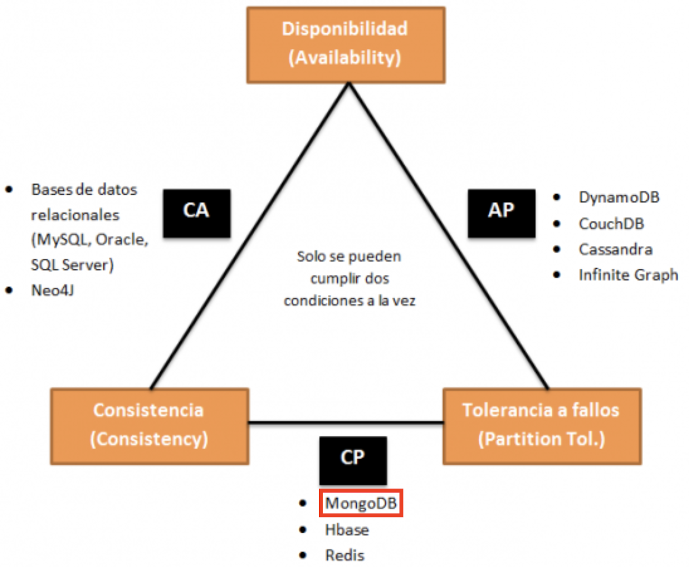

+++
title = "MongoDB: Introducción"
date = 2020-03-05T01:00:18+00:00
updated = 2020-03-20T10:31:10+00:00
+++

Este es el primer post en la serie sobre Mongo, en el cuál introduciremos dicha bases de datos NoSQL y veremos sus características e instalación.

Otros posts en esta serie:

* [MongoDB: Introducción](/blog/mdad/mongodb-introduction/) (este post)
* [MongoDB: Operaciones Básicas y Arquitectura](/blog/mdad/mongodb-operaciones-basicas-y-arquitectura/)

Este post está hecho en colaboración con un compañero.

----------



## Definición

MongoDB es una base de datos orientada a documentos. Esto quiere decir que en lugar de guardar los datos en registros, guarda los datos en documentos. Estos documentos son almacenados en BSON, que es una representación binaria de JSON. Una de las principales diferencias respecto a las bases de datos relacionales es que no necesita seguir ningún esquema, los documentos de una misma colección pueden tener esquemas diferentes.

MongoDB está escrito en C++, aunque las consultas se hacen pasando objetos JSON como parámetro.

```
{
        "_id" : ObjectId("52f602d787945c344bb4bda5"),
        "name" : "Tyrion",
        "hobbies" : [
            "books",
            "girls",
            "wine"
        ],
        "friends" : [
            {
                "name" : "Bronn",
                "ocuppation" : "sellsword"
            },
            {
                "name" : "Shae",
                "ocuppation" : "handmaiden"
            }
        ]
 }
```

## Características



MongoDB alcanza un balance perfecto entre rendimiento y funcionalidad gracias a su sistema de consulta de contenidos. Pero sus características principales no se limitan solo a esto, también cuenta con otras que lo posicionan como el preferido de muchos desarrolladores de aplicaciones como aplicaciones móviles, gaming, logging o e-commerce.

Algunas de las principales características de esta base de datos son:

* Almacenamiento orientado a documentos (documentos JSON con esquemas dinámicos).
* Soporte Full index: puede crear índices sobre cualquier atributo y añadir múltiples índices secundarios.
* Replicación y alta disponibilidad: espejos entre LANs y WANs.
* Auto-Sharding: escalabilidad horizontal sin comprometer la funcionalidad, está limitada, actualmente, a 20 nodos, aunque el objetivo es alcanzar una cifra cercana a los 1000.
* Consultas ricas y basadas en documentos.
* Rápidas actualizaciones en el contexto.
* Soporte comercial, capacitación y consultoría disponibles.
* También puede ser utilizada para el almacenamiento de archivos aprovechando la capacidad de MongoDB para el balanceo de carga y la replicación de datos.

En cuanto a la arquitectura, podríamos decir que divide en tres partes: las bases de datos, las colecciones y los documentos (que contienen los campos de cada entrada).

* **Base de datos**: cada una de las bases de datos tiene un conjunto propio de archivos en el sistema de archivos con diversas bases de datos existentes en un solo servidor.
* **Colección**: un conjunto de documentos de base de datos. El equivalente RDBMS de la colección es una tabla. Toda colección existe dentro de una única base de datos.
* **Documento**: un conjunto de pares clave/valor. Los documentos están asociados con esquemas dinámicos. La ventaja de tener esquemas dinámicos es que el documento en una sola colección no tiene que tener la misma estructura o campos.

## Arista dentro del Teorema CAP



MongoDB es CP por defecto, es decir, garantiza consistencia y tolerancia a particiones (fallos). Pero también podemos configurar el nivel de consistencia, eligiendo el número de nodos a los que se replicarán los datos. O podemos configurar si se pueden leer datos de los nodos secundarios (en MongoDB solo hay un servidor principal, que es el único que acepta inserciones o modificaciones). Si permitimos leer de un nodo secundario mediante la replicación, sacrificamos consistencia, pero ganamos disponibilidad.

## Descarga e instalación

### Windows

Descargar el archivo desde [https://www.mongodb.com/download-center#production](https://www.mongodb.com/download-center#production)

1. Doble clic en el archivo `.msi`
2. El instalador de Windows lo guía a través del proceso de instalación.
Si elige la opción de instalación personalizada, puede especificar un directorio de instalación.
MongoDB no tiene ninguna otra dependencia del sistema. Puede instalar y ejecutar MongoDB desde cualquier carpeta que elija.
3. Ejecutar el `.exe` que hemos instalado.

### Linux

Abrimos una terminal y ejecutamos:

```
sudo apt-get update
sudo apt install -y mongodb-org
```

Luego comprobamos el estado del servicio:

```
sudo systemctl start mongod
sudo systemctl status mongod
```

Finalmente ejecutamos la base de datos con el comando:

```
sudo mongo
```

### macOS

Abrimos una terminal y ejecutamos:

```
brew update
brew install mongodb
```

Iniciamos el servicio:

```
brew services start mongodb
```

## Referencias

* [Todo lo que debes saber sobre MongoDB](https://expertoenbigdata.com/que-es-mongodb/#La_arquitectura_de_MongoDB)
* [MongoDB – EcuRed](https://www.ecured.cu/MongoDB)
* [Bases de datos NoSQL, MongoDB y GIS – MappingGIS](https://mappinggis.com/2014/07/mongodb-y-gis/)
* [Características MONGO DB](https://es.slideshare.net/maxfontana90/caractersticas-mongo-db)
* [Qué es MongoDB y características](https://openwebinars.net/blog/que-es-mongodb)
* [MongoDB. Qué es, cómo funciona y cuándo podemos usarlo (o no)](https://www.genbeta.com/desarrollo/mongodb-que-es-como-funciona-y-cuando-podemos-usarlo-o-no)
* [MongoDB Documentation](https://docs.mongodb.com/)
* [NoSQL: Clasificación de las bases de datos según el teorema CAP](https://www.genbeta.com/desarrollo/nosql-clasificacion-de-las-bases-de-datos-segun-el-teorema-cap)