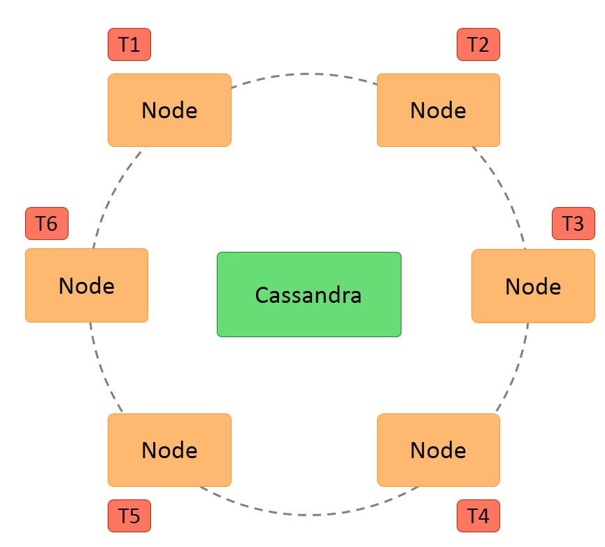
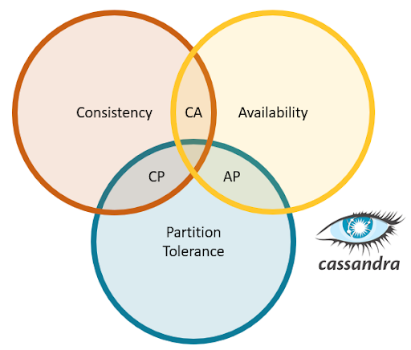
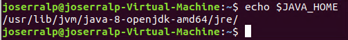
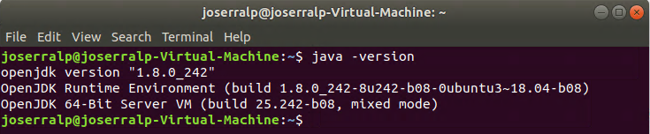
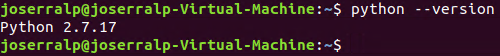
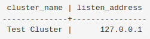

+++
title = "Cassandra: an Introduction"
date = 2020-03-05T00:00:45+00:00
updated = 2020-03-18T09:47:05+00:00
+++

This is the first post in the Cassandra series, where we will introduce the Cassandra database system and take a look at its features and installation methods.

Other posts in this series:

* [Cassandra: an Introduction](/blog/ribw/cassandra-an-introduction/) (this post)

This post is co-authored with Classmate.

----------


## Purpose of technology

Apache Cassandra is a **NoSQL**, **open-source**, **distributed “key-value” database**. It allows **large volumes of distributed data**. The main **goal **is provide **linear scalability and availabilitywithout compromising performance**. Besides, Cassandra **supports replication** across multiple datacenters, providing low latency.

## How it works

Cassandra’s distributed **architecture **is based on a series of **equal nodes** that communicate with a **P2P protocol** so that **redundancy is maximum**. It offers robust support for multiple datacenters, with **asynchronous replication** without the need for a master server.

Besides, Cassandra’s **data model consists of partitioning the rows**, which are rearranged into **different tables**. The primary keys of each table have a first component that is the **partition key**. Within a partition, the rows are grouped by the remaining columns of the key. The other columns can be indexed separately from the primary key.

These tables can be **created, deleted, updated and queried****at runtime without blocking** each other. However it does **not support joins or subqueries**, but instead **emphasizes denormalization** through features like collections.

Nowadays, Cassandra uses its own query language called **CQL** (**Cassandra Query Language**), with a **similar syntax to SQL**. It also allows access from **JDBC**.


_ Cassandra architecture _

## Features

* **Decentralized**: there are **no single points of failure**, every **node **in the cluster has the **same role** and there is **no master node**, so each node **can service any request**, besides the data is distributed across the cluster.
* Supports **replication **and multiple replication of **data center**: the replication strategies are **configurable**.
* **Scalability: **reading and writing performance increases linearly as new nodes are added, also **new nodes** can be **added without interrupting** application **execution**.
* **Fault tolerance: data replication** is done **automatically **in several nodes in order to recover from failures. It is possible to **replace failure nodes****without **making** inactivity time or interruptions** to the application.
* **Consistency: **a choice of consistency level is provided for **reading and writing**.
* **MapReduce support**: it is **integrated **with **Apache Hadoop** to support MapReduce.
* **Query language**: it has its own query language called **CQL (Cassandra Query Language) **

## Corner in CAP theorem

**Apache Cassandra** is usually described as an “**AP**” system because it guarantees **availability** and **partition/fault tolerance**. So it errs on the side of ensuring data availability even if this means **sacrificing consistency**. But, despite this fact, Apache Cassandra **seeks to satisfy all three requirements** (Consistency, Availability and Fault tolerance) simultaneously and can be **configured to behave** like a “**CP**” database, guaranteeing **consistency and partition/fault tolerance**.


_Cassandra in CAP Theorem_

## Download

In order to download the file, with extension .tar.gz. you must visit the [download site](https://cassandra.apache.org/download/) and click on the file “[https://ftp.cixug.es/apache/cassandra/3.11.6/apache-cassandra-3.11.6-bin.tar.gz](https://ftp.cixug.es/apache/cassandra/3.11.6/apache-cassandra-3.11.6-bin.tar.gz)”. It is important to mention that the previous link is related to the 3.11.6 version.

## Installation

This database can only be installed on Linux distributions and Mac OS X systems, so, it is not possible to install it on Microsoft Windows.

The first main requirement is having installed Java 8 in **Ubuntu**, the OS that we will use. Therefore, the Java 8 installation is explained below. First open a terminal and execute the next command:

```
sudo apt update
sudo apt install openjdk-8-jdk openjdk-8-jre
```

In order to establish Java as a environment variable it is needed to open the file “/.bashrc”:

```
nano ~/.bashrc
```

And add at the end of it the path where Java is installed, as follows:

```
export JAVA_HOME=/usr/lib/jvm/java-8-openjdk-amd64/jre/
export PATH=$PATH:$JAVA_HOME/bin
```

 At this point, save the file and execute the next command, note that it does the same effect re-opening the terminal:

```
source ~/.bashrc
```

In order to check if the Java environment variable is set correctly, run the next command:

```
echo $JAVA_HOME
```


_$JAVAHOME variable_

Afterwards, it is possible to check the installed Java version with the command:

```
java -version
```


_Java version_

The next requirement is having installed the latest version of Python 2.7. This can be checked with the command:

```
python --version
```

If it is not installed, to install it, it is as simple as run the next command in the terminal:

```
sudo apt install python
```

Note: it is better to use “python2” instead of “python” because in that way, you force to user Python 2.7. Modern distributions will use Python 3 for the «python» command.

Therefore, it is possible to check the installed Python version with the command:

```
python --version
```


_Python version_

Once both requirements are ready, next step is to unzip the file previously downloaded, right click on the file and select “Extract here” or with the next command, on the directory where is the downloaded file.

```
tar -zxvf apache-cassandra-x.x.x-bin.tar.gz
```

In order to check if the installation is completed, you can execute the next command, in the root folder of the project. This will start Cassandra in a single node.

```
/bin/cassandra
```

It is possible to make a get some data from Cassandra with CQL (Cassandra Query Language). To check this execute the next command in another terminal.

```
/bin/cqlsh localhost
```

Once CQL is open, type the next sentence and check the result:

```
SELECT cluster_name, listen_address from system.local;
```

The output should be:


_Sentence output_

Finally, the installation guide provided by the website of the database is attached in this [installation guide](https://cassandra.apache.org/doc/latest/getting_started/installing.html).

## References

* [Wikipedia](https://es.wikipedia.org/wiki/Apache_Cassandra)
* [Apache Cassandra](https://cassandra.apache.org/)
* [Datastax](https://www.datastax.com/blog/2019/05/how-apache-cassandratm-balances-consistency-availability-and-performance)
* [yugabyte](https://blog.yugabyte.com/apache-cassandra-architecture-how-it-works-lightweight-transactions/)
