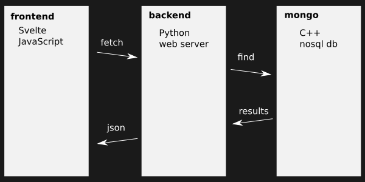

+++
title = "Developing a Python application for MongoDB"
date = 2020-03-25T00:00:04+00:00
updated = 2020-04-16T08:01:23+00:00
+++

This is the third and last post in the MongoDB series, where we will develop a Python application to process and store OpenData inside Mongo.

Other posts in this series:

* [MongoDB: an Introduction](/blog/ribw/mongodb-an-introduction/)
* [MongoDB: Basic Operations and Architecture](/blog/ribw/mongodb-basic-operations-and-architecture/)
* [Developing a Python application for MongoDB](/blog/ribw/developing-a-python-application-for-mongodb/) (this post)

This post is co-authored wih a Classmate.

----------

## What are we making?

We are going to develop a web application that renders a map, in this case, the town of Cáceres, with which users can interact. When the user clicks somewhere on the map, the selected location will be sent to the server to process. This server will perform geospatial queries to Mongo and once the results are ready, the information is presented back at the webpage.

The data used for the application comes from [Cáceres’ OpenData](https://opendata.caceres.es/), and our goal is that users will be able to find information about certain areas in a quick and intuitive way, such as precise coordinates, noise level, and such.

## What are we using?

The web application will be using [Python](https://python.org/) for the backend, [Svelte](https://svelte.dev/) for the frontend, and [Mongo](https://www.mongodb.com/) as our storage database and processing center.

* **Why Python?** It’s a comfortable language to write and to read, and has a great ecosystem with [plenty of libraries](https://pypi.org/).
* **Why Svelte?** Svelte is the New Thing**™** in the world of component frameworks for JavaScript. It is similar to React or Vue, but compiled and with a lot less boilerplate. Check out their [Svelte post](https://svelte.dev/blog/svelte-3-rethinking-reactivity) to learn more.
* **Why Mongo?** We believe NoSQL is the right approach for doing the kind of processing and storage that we expect, and it’s [very easy to use](https://docs.mongodb.com/). In addition, we will be making Geospatial Queries which [Mongo supports](https://docs.mongodb.com/manual/geospatial-queries/).

Why didn’t we choose to make a smaller project, you may ask? You will be shocked to hear that we do not have an answer for that!

Note that we will not be embedding **all** the code of the project in this post, or it would be too long! We will include only the relevant snippets needed to understand the core ideas of the project, and not the unnecessary parts of it (for example, parsing configuration files to easily change the port where the server runs is not included).

## Python dependencies

Because we will program it in Python, you need Python installed. You can install it using a package manager of your choice or heading over to the [Python downloads section](https://www.python.org/downloads/), but if you’re on Linux, chances are you have it installed already.

Once Python 3.7 or above is installed, install [`motor` (Asynchronous Python driver for MongoDB)](https://motor.readthedocs.io/en/stable/) and the [`aiohttp` server](https://docs.aiohttp.org/en/stable/web.html) through `pip`:

```
pip install aiohttp motor
```

Make sure that Mongo is running in the background (this has been described in previous posts), and we should be able to get to work.

## Web dependencies

To work with Svelte and its dependencies, we will need `[npm](https://www.npmjs.com/)` which comes with [NodeJS](https://nodejs.org/en/), so go and [install Node from their site](https://nodejs.org/en/download/). The download will be different depending on your operating system.

Following [the easiest way to get started with Svelte](https://svelte.dev/blog/the-easiest-way-to-get-started), we will put our project in a `client/` folder (because this is what the clients see, the frontend). Feel free to tinker a bit with the configuration files to change the name and such, although this isn’t relevant for the rest of the post.

## Finding the data

We are going to work with the JSON files provided by [OpenData Cáceres](http://opendata.caceres.es/). In particular, we want information about the noise, census, vias and trees. To save you the time from [searching each of these](http://opendata.caceres.es/dataset), we will automate the download with code.

If you want to save the data offline or just know what data we’ll be using for other purposes though, you can right click on the following links and select «Save Link As…» with the name of the link:

* `[noise.json](http://opendata.caceres.es/GetData/GetData?dataset=om:MedicionRuido&format=json)`
* `[census.json](http://opendata.caceres.es/GetData/GetData?dataset=om:InformacionPadron&year=2017&format=json)`
* `[vias.json](http://opendata.caceres.es/GetData/GetData?dataset=om:InformacionPadron&year=2017&format=json)`
* `[trees.json](http://opendata.caceres.es/GetData/GetData?dataset=om:Arbol&format=json)`

## Backend

It’s time to get started with some code! We will put it in a `server/` folder because it will contain the Python server, that is, the backend of our application.

We are using `aiohttp` because we would like our server to be `async`. We don’t expect a lot of users at the same time, but it’s good to know our server would be well-designed for that use-case. As a bonus, it makes IO points clear in the code, which can help reason about it. The implicit synchronization between `await` is also a nice bonus.

### Saving the data in Mongo

Before running the server, we must ensure that the data we need is already stored and indexed in Mongo. Our `server/data.py` will take care of downloading the files, cleaning them up a little (Cáceres’ OpenData can be a bit awkward sometimes), inserting them into Mongo and indexing them.

Downloading the JSON data can be done with `[ClientSession.get](https://aiohttp.readthedocs.io/en/stable/client_reference.html#aiohttp.ClientSession.get)`. We also take this opportunity to clean up the messy encoding from the JSON, which does not seem to be UTF-8 in some cases.

```
async def load_json(session, url):
    fixes = [(old, new.encode('utf-8')) for old, new in [
        (b'\xc3\x83\\u2018', 'Ñ'),
        (b'\xc3\x83\\u0081', 'Á'),
        (b'\xc3\x83\\u2030', 'É'),
        (b'\xc3\x83\\u008D', 'Í'),
        (b'\xc3\x83\\u201C', 'Ó'),
        (b'\xc3\x83\xc5\xa1', 'Ú'),
        (b'\xc3\x83\xc2\xa1', 'á'),
    ]]

    async with session.get(url) as resp:
        data = await resp.read()

    # Yes, this feels inefficient, but it's not really worth improving.
    for old, new in fixes:
        data = data.replace(old, new)

    data = data.decode('utf-8')
    return json.loads(data)
```

Later on, it can be reused for the various different URLs:

```
import aiohttp

NOISE_URL = 'http://opendata.caceres.es/GetData/GetData?dataset=om:MedicionRuido&format=json'
# (...other needed URLs here)

async def insert_to_db(db):
    async with aiohttp.ClientSession() as session:
        data = await load_json(session, NOISE_URL)
        # now we have the JSON data cleaned up, ready to be parsed
```

### Data model

With the JSON data in our hands, it’s time to parse it. Always remember to [parse, don’t validate](https://lexi-lambda.github.io/blog/2019/11/05/parse-don-t-validate/). With [Python 3.7 `dataclasses`](https://docs.python.org/3/library/dataclasses.html) it’s trivial to define classes that will store only the fields we care about, typed, and with proper names:

```
from dataclasses import dataclass

Longitude = float
Latitude = float

@dataclass
class GSON:
    type: str
    coordinates: (Longitude, Latitude)

@dataclass
class Noise:
    id: int
    geo: GSON
    level: float
```

This makes it really easy to see that, if we have a `Noise`, we can access its `geo` data which is a `GSON` with a `type` and `coordinates`, having `Longitude` and `Latitude` respectively. `dataclasses` and `[typing](https://docs.python.org/3/library/typing.html)` make dealing with this very easy and clear.

Every dataclass will be on its own collection inside Mongo, and these are:

* Noise
* Integer `id`
* GeoJSON `geo`
* String `type`
* Longitude-latitude pair `coordinates`

* Floating-point number `level`

* Tree
* String `name`
* String `gender`
* Integer `units`
* Floating-point number `height`
* Floating-point number `cup_diameter`
* Floating-point number `trunk_diameter`
* Optional string `variety`
* Optional string `distribution`
* GeoJSON `geo`
* Optional string `irrigation`

* Census
* Integer `year`
* Via `via`
* String `name`
* String `kind`
* Integer `code`
* Optional string `history`
* Optional string `old_name`
* Optional floating-point number `length`
* Optional GeoJSON `start`
* GeoJSON `middle`
* Optional GeoJSON `end`
* Optional list with geometry pairs `geometry`

* Integer `count`
* Mapping year-to-count `count_per_year`
* Mapping gender-to-count `count_per_gender`
* Mapping nationality-to-count `count_per_nationality`
* Integer `time_year`

Now, let’s define a method to actually parse the JSON and yield instances from these new data classes:

```
@classmethod
def iter_from_json(cls, data):
    for row in data['results']['bindings']:
        noise_id = int(row['uri']['value'].split('/')[-1])
        long = float(row['geo_long']['value'])
        lat = float(row['geo_lat']['value'])
        level = float(row['om_nivelRuido']['value'])

        yield cls(
            id=noise_id,
            geo=GSON(type='Point', coordinates=[long, lat]),
            level=level
        )
```

Here we iterate over the input JSON `data` bindings and `yield cls` instances with more consistent naming than the original one. We also extract the data from the many unnecessary nested levels of the JSON and have something a lot flatter to work with.

For those of you who don’t know what `yield` does (after all, not everyone is used to seeing generators), here’s two functions that work nearly the same:

```
def squares_return(n):
    result = []
    for i in range(n):
        result.append(n ** 2)
    return result

def squares_yield(n):
    for i in range(n):
        yield n ** 2
```

The difference is that the one with `yield` is «lazy» and doesn’t need to do all the work up-front. It will generate (yield) more values as they are needed when you use a `for` loop. Generally, it’s a better idea to create generator functions than do all the work early which may be unnecessary. See [What does the «yield» keyword do?](https://stackoverflow.com/questions/231767/what-does-the-yield-keyword-do) if you still have questions.

With everything parsed, it’s time to insert the data into Mongo. If the data was not present yet (0 documents), then we will download the file, parse it, insert it as documents into the given Mongo `db`, and index it:

```
from dataclasses import asdict

async def insert_to_db(db):
    async with aiohttp.ClientSession() as session:
        if await db.noise.estimated_document_count() == 0:
            data = await load_json(session, NOISE_URL)

            await db.noise.insert_many(asdict(noise) for noise in Noise.iter_from_json(data))
            await db.noise.create_index([('geo', '2dsphere')])
```

We repeat this process for all the other data, and just like that, Mongo is ready to be used in our server.

### Indices

In order to execute our geospatial queries we have to create an index on the attribute that represents the location, because the operators that we will use requires it. This attribute can be a [GeoJSON object](https://docs.mongodb.com/manual/reference/geojson/) or a legacy coordinate pair.

We have decided to use a GeoJSON object because we want to avoid legacy features that may be deprecated in the future.

The attribute is called `geo` for the `Tree` and `Noise` objects and `start`, `middle` or `end` for the `Via` class. In the `Via` we are going to index the attribute `middle` because it is the most representative field for us. Because the `Via` is inside the `Census` and it doesn’t have its own collection, we create the index on the `Census` collection.

The used index type is `2dsphere` because it supports queries that work on geometries on an earth-like sphere. Another option is the `2d` index but it’s not a good fit for our because it is for queries that calculate geometries on a two-dimensional plane.

### Running the server

If we ignore the configuration part of the server creation, our `server.py` file is pretty simple. Its job is to create a [server application](https://aiohttp.readthedocs.io/en/stable/web.html), setup Mongo and return it to the caller so that they can run it:

```
import asyncio
import subprocess
import motor.motor_asyncio

from aiohttp import web

from . import rest, data

def create_app():
    ret = subprocess.run('npm run build', cwd='../client', shell=True).returncode
    if ret != 0:
        exit(ret)

    db = motor.motor_asyncio.AsyncIOMotorClient().opendata
    loop = asyncio.get_event_loop()
    loop.run_until_complete(data.insert_to_db(db))

    app = web.Application()
    app['db'] = db

    app.router.add_routes([
        web.get('/', lambda r: web.HTTPSeeOther('/index.html')),
        *rest.ROUTES,
        web.static('/', os.path.join(config['www']['root'], 'public')),
    ])

    return app
```

There’s a bit going on here, but it’s nothing too complex:

* We automatically run `npm run build` on the frontend because it’s very comfortable to have the frontend built automatically before the server runs.
* We create a Motor client and access the `opendata` database. Into it, we load the data, effectively saving it in Mongo for the server to use.
* We create the server application and save a reference to the Mongo database in it, so that it can be used later on any endpoint without needing to recreate it.
* We define the routes of our app: root, REST and static (where the frontend files live). We’ll get to the `rest` part soon.
Running the server is now simple:

```
def main():
    from aiohttp import web
    from . import server

    app = server.create_app()
    web.run_app(app)

if __name__ == '__main__':
    main()
```

### REST endpoints

The frontend will communicate with the backend via [REST](https://en.wikipedia.org/wiki/Representational_state_transfer) calls, so that it can ask for things like «give me the information associated with this area», and the web server can query the Mongo server to reply with a HTTP response. This little diagram should help:



What we need to do, then, is define those REST endpoints we mentioned earlier when creating the server. We will process the HTTP request, ask Mongo for the data, and return the HTTP response:

```
import asyncio
import pymongo

from aiohttp import web

async def get_area_info(request):
    try:
        long = float(request.query['long'])
        lat = float(request.query['lat'])
        distance = float(request.query['distance'])
    except KeyError as e:
        raise web.HTTPBadRequest(reason=f'a required parameter was missing: {e.args[0]}')
    except ValueError:
        raise web.HTTPBadRequest(reason='one of the parameters was not a valid float')

    geo_avg_noise_pipeline = [{
        '$geoNear': {
            'near' : {'type': 'Point', 'coordinates': [long, lat]},
            'maxDistance': distance,
            'minDistance': 0,
            'spherical' : 'true',
            'distanceField' : 'distance'
        }
    }]

    db = request.app['db']

    try:
        noise_count, sum_noise, avg_noise = 0, 0, 0
        async for item in db.noise.aggregate(geo_avg_noise_pipeline):
            noise_count += 1
            sum_noise += item['level']

        if noise_count != 0:
            avg_noise = sum_noise / noise_count
        else:
            avg_noise = None

    except pymongo.errors.ConnectionFailure:
        raise web.HTTPServiceUnavailable(reason='no connection to database')

    return web.json_response({
        'tree_count': tree_count,
        'trees_per_type': [[k, v] for k, v in trees_per_type.items()],
        'census_count': census_count,
        'avg_noise': avg_noise,
    })

ROUTES = [
    web.get('/rest/get-area-info', get_area_info)
]
```

In this code, we’re only showing how to return the average noise because that’s the simplest we can do. The real code also fetches tree count, tree count per type, and census count.

Again, there’s quite a bit to go through, so let’s go step by step:

* We parse the frontend’s `request.query` into `float` that we can use. In particular, the frontend is asking us for information at a certain latitude, longitude, and distance. If the query is malformed, we return a proper error.
* We create our query for Mongo outside, just so it’s clearer to read.
* We access the database reference we stored earlier when creating the server with `request.app['db']`. Handy!
* We try to query Mongo. It may fail if the Mongo server is not running, so we should handle that and tell the client what’s happening. If it succeeds though, we will gather information about the average noise.
* We return a `json_response` with Mongo results for the frontend to present to the user.
You may have noticed we defined a `ROUTES` list at the bottom. This will make it easier to expand in the future, and the server creation won’t need to change anything in its code, because it’s already unpacking all the routes we define here.

### Geospatial queries

In order to retrieve the information from Mongo database we have defined two geospatial queries:

```
geo_query = {
    '$nearSphere' : {
        '$geometry': {
            'type': 'Point',
            'coordinates': [long, lat]
         },
        '$maxDistance': distance,
        '$minDistance': 0
    }
}
```

This query uses [the operator `$nearSphere`](https://docs.mongodb.com/manual/reference/operator/query/nearSphere/#op._S_nearSphere) which return geospatial objects in proximity to a point on a sphere.

The sphere point is represented by the `$geometry` operator where it is specified the type of geometry and the coordinates (given by the HTTP request).

The maximum and minimum distance are represented by `$maxDistance` and `$minDistance` respectively. We specify that the maximum distance is the radio selected by the user.

```
geo_avg_noise_pipeline = [{
    '$geoNear': {
        'near' : {'type': 'Point', 'coordinates': [long, lat]},
        'maxDistance': distance,
        'minDistance': 0,
        'spherical' : 'true',
        'distanceField' : 'distance'
    }
}]
```

This query uses the [aggregation pipeline](https://docs.mongodb.com/manual/core/aggregation-pipeline/) stage [`$geoNear`](https://docs.mongodb.com/manual/reference/operator/aggregation/geoNear/#pipe._S_geoNear) which returns an ordered stream of documents based on the proximity to a geospatial point. The output documents include an additional distance field.

The `near` field is mandatory and is the point for which to find the closest documents. In this field it is specified the type of geometry and the coordinates (given by the HTTP request).

The `distanceField` field is also mandatory and is the output field that will contain the calculated distance. In this case we’ve just called it `distance`.

Some other fields are `maxDistance` that indicates the maximum allowed distance from the center of the point, `minDistance` for the minimum distance, and `spherical` which tells MongoDB how to calculate the distance between two points.

We specify the maximum distance as the radio selected by the user in the frontend.

## Frontend

As said earlier, our frontend will use Svelte. We already downloaded the template, so we can start developing. For some, this is the most fun part, because they can finally see and interact with some of the results. But for this interaction to work, we needed a functional backend which we now have!

### REST queries

The frontend has to query the server to get any meaningful data to show on the page. The [Fetch API](https://developer.mozilla.org/en-US/docs/Web/API/Fetch_API) does not throw an exception if the server doesn’t respond with HTTP OK, but we would like one if things go wrong, so that we can handle them gracefully. The first we’ll do is define our own exception [which is not pretty](https://stackoverflow.com/a/27724419):

```
function NetworkError(message, status) {
    var instance = new Error(message);
    instance.name = 'NetworkError';
    instance.status = status;
    Object.setPrototypeOf(instance, Object.getPrototypeOf(this));
    if (Error.captureStackTrace) {
        Error.captureStackTrace(instance, NetworkError);
    }
    return instance;
}

NetworkError.prototype = Object.create(Error.prototype, {
    constructor: {
        value: Error,
        enumerable: false,
        writable: true,
        configurable: true
    }
});
Object.setPrototypeOf(NetworkError, Error);
```

But hey, now we have a proper and reusable `NetworkError`! Next, let’s make a proper and reusabe `query` function that deals with `fetch` for us:

```
async function query(endpoint) {
    const res = await fetch(endpoint, {
        // if we ever use cookies, this is important
        credentials: 'include'
    });
    if (res.ok) {
        return await res.json();
    } else {
        throw new NetworkError(await res.text(), res.status);
    }
}
```

At last, we can query our web server. The export here tells Svelte that this function should be visible to outer modules (public) as opposed to being private:

```
export function get_area_info(long, lat, distance) {
    return query(`/rest/get-area-info?long=${long}&lat=${lat}&distance=${distance}`);
}
```

The attentive reader will have noticed that `query` is `async`, but `get_area_info` is not. This is intentional, because we don’t need to `await` for anything inside of it. We can just return the `[Promise](https://developer.mozilla.org/en-US/docs/Web/JavaScript/Reference/Global_Objects/Promise)` that `query` created and let the caller `await` it as they see fit. The `await` here would have been redundant.

For those of you who don’t know what a JavaScript promise is, think of it as an object that represents «an eventual result». The result may not be there yet, but we promised it will be present in the future, and we can `await` for it. You can also find the same concept in other languages like Python under a different name, such as [`Future`](https://docs.python.org/3/library/asyncio-future.html#asyncio.Future).

### Map component

In Svelte, we can define self-contained components that are issolated from the rest. This makes it really easy to create a modular application. Think of a Svelte component as your own HTML tag, which you can customize however you want, building upon the already-existing components HTML has to offer.

The main thing that our map needs to do is render the map as an image and overlay the selection area as the user hovers the map with their mouse. We could render the image in the canvas itself, but instead we’ll use the HTML `` tag for that and put a transparent `<canvas>` on top with some CSS. This should make it cheaper and easier to render things on the canvas.

The `Map` component will thus render as the user moves the mouse over it, and produce an event when they click so that whatever component is using a `Map` knows that it was clicked. Here’s the final CSS and HTML:

```
<style>
div {
    position: relative;
}
canvas {
    position: absolute;
    left: 0;
    top: 0;
    cursor: crosshair;
}
</style>

<div>
    
    <canvas
        bind:this={canvas}
        on:mousemove={handleMove}
        on:wheel={handleWheel}
        on:mouseup={handleClick}/>
</div>
```

We hardcode a map source here, but ideally this would be provided by the server. The project is already complex enough, so we tried to avoid more complexity than necessary.

We bind the tags to some variables declared in the JavaScript code of the component, along with some functions and parameters to let the users of `Map` customize it just a little.

Here’s the gist of the JavaScript code:

```
<script>
    import { createEventDispatcher, onMount } from 'svelte';

    export let height = 200;

    const dispatch = createEventDispatcher();

    let img;
    let canvas;

    const LONG_WEST = -6.426881;
    const LONG_EAST = -6.354143;
    const LAT_NORTH = 39.500064;
    const LAT_SOUTH = 39.443201;

    let x = 0;
    let y = 0;
    let clickInfo = null; // [x, y, radius]
    let radiusDelta = 0.005 * height;
    let maxRadius = 0.2 * height;
    let minRadius = 0.01 * height;
    let radius = 0.05 * height;

    function handleLoad() {
        canvas.width = img.width;
        canvas.height = img.height;
    }

    function handleMove(event) {
        const { left, top } = this.getBoundingClientRect();
        x = Math.round(event.clientX - left);
        y = Math.round(event.clientY - top);
    }

    function handleWheel(event) {
        if (event.deltaY < 0) {
            if (radius < maxRadius) {
                radius += radiusDelta;
            }
        } else {
            if (radius > minRadius) {
                radius -= radiusDelta;
            }
        }
        event.preventDefault();
    }

    function handleClick(event) {
        dispatch('click', {
            // the real code here maps the x/y/radius values to the right range, here omitted
            x: ...,
            y: ...,
            radius: ...,
        });
    }

    onMount(() => {
        const ctx = canvas.getContext('2d');
        let frame;

        (function loop() {
            frame = requestAnimationFrame(loop);

            // the real code renders mouse area/selection, here omitted for brevity
            ...
        }());

        return () => {
            cancelAnimationFrame(frame);
        };
    });
</script>
```

Let’s go through bit-by-bit:

* We define a few variables and constants for later use in the final code.
* We define the handlers to react to mouse movement and clicks. On click, we dispatch an event to outer components.
* We setup the render loop with animation frames, and cancel the current frame appropriatedly if the component disappears.

### App component

Time to put everything together! We wil include our function to make REST queries along with our `Map` component to render things on screen.

```
<script>
    import Map from './Map.svelte';
    import { get_area_info } from './rest.js'
    let selection = null;
    let area_info_promise = null;
    function handleMapSelection(event) {
        selection = event.detail;
        area_info_promise = get_area_info(selection.x, selection.y, selection.radius);
    }
    function format_avg_noise(avg_noise) {
        if (avg_noise === null) {
            return '(no data)';
        } else {
            return `${avg_noise.toFixed(2)} dB`;
        }
    }
</script>

<div class="container-fluid">
    <div class="row">
        <div class="col-3" style="max-width: 300em;">
            <div class="text-center">
                <h1>Caceres Data Consultory</h1>
            </div>
            <Map height={400} on:click={handleMapSelection}/>
            <div class="text-center mt-4">
                {#if selection === null}
                        <p class="m-1 p-3 border border-bottom-0 bg-info text-white">Click on the map to select the area you wish to see details for.</p>
                {:else}
                        <h2 class="bg-dark text-white">Selected area</h2>
                        <p><b>Coordinates:</b> ({selection.x}, {selection.y})</p>
                        <p><b>Radius:</b> {selection.radius} meters</p>
                {/if}
            </div>
        </div>
        <div class="col-sm-4">
            <div class="row">
            {#if area_info_promise !== null}
                {#await area_info_promise}
                    <p>Fetching area information…</p>
                {:then area_info}
                    <div class="col">
                        <div class="text-center">
                            <h2 class="m-1 bg-dark text-white">Area information</h2>
                            <ul class="list-unstyled">
                                <li>There are <b>{area_info.tree_count} trees </b> within the area</li>
                                <li>The <b>average noise</b> is <b>{format_avg_noise(area_info.avg_noise)}</b></li>
                                <li>There are <b>{area_info.census_count} persons </b> within the area</li>
                            </ul>
                        </div>
                        {#if area_info.trees_per_type.length > 0}
                            <div class="text-center">
                                <h2 class="m-1 bg-dark text-white">Tree count per type</h2>
                            </div>
                            <ul class="list-group">
                                {#each area_info.trees_per_type as [type, count]}
                                    <li class="list-group-item">{type} <span class="badge badge-dark float-right">{count}</span></li>
                                {/each}
                            </ul>
                        {/if}
                    </div>
                {:catch error}
                    <p>Failed to fetch area information: {error.message}</p>
                {/await}
            {/if}
            </div>
        </div>
    </div>
</div>
```

* We import the `Map` component and REST function so we can use them.
* We define a listener for the events that the `Map` produces. Such event will trigger a REST call to the server and save the result in a promise used later.
* We’re using Bootstrap for the layout because it’s a lot easier. In the body we add our `Map` and another column to show the selection information.
* We make use of Svelte’s `{#await}` to nicely notify the user when the call is being made, when it was successful, and when it failed. If it’s successful, we display the info.

## Results

Lo and behold, watch our application run!

<video controls="controls" src="sr-2020-04-14_09-28-25.mp4"></video>

In this video you can see our application running, but let’s describe what is happening in more detail.

When the application starts running (by opening it in your web browser of choice), you can see a map with the town of Cáceres. Then you, the user, can click to retrieve the information within the selected area.

It is important to note that one can make the selection area larger or smaller by trying to scroll up or down, respectively.

Once an area is selected, it is colored green in order to let the user know which area they have selected. Under the map, the selected coordinates and the radius (in meters) is also shown for the curious. At the right side the information concerning the selected area is shown, such as the number of trees, the average noise and the number of persons. If there are trees in the area, the application also displays the trees per type, sorted by the number of trees.

## Download

We hope you enjoyed reading this post as much as we enjoyed writing it! Feel free to download the final project and play around with it. Maybe you can adapt it for even more interesting purposes!

*download removed*

To run the above code:

1. Unzip the downloaded file.
2. Make a copy of `example-server-config.ini` and rename it to `server-config.ini`, then edit the file to suit your needs.
3. Run the server with `python -m server`.
4. Open [localhost:9000](http://localhost:9000) in your web browser (or whatever port you chose) and enjoy!