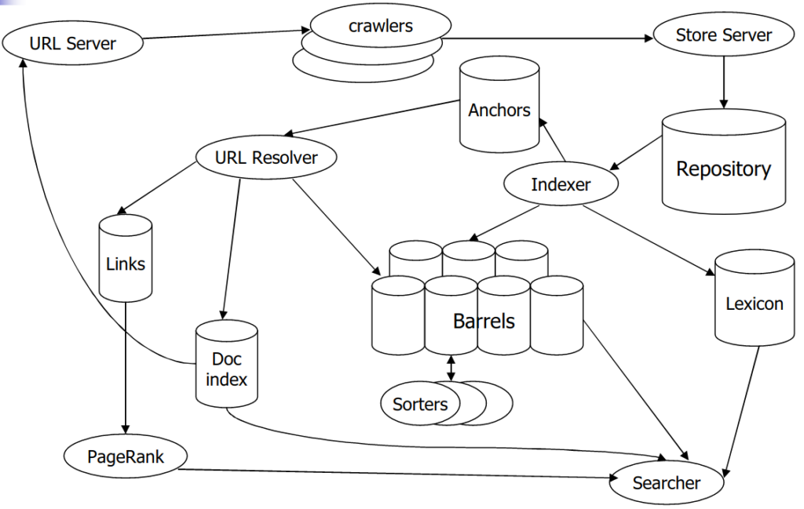

```meta
title: How does Google’s Search Engine work?
published: 2020-03-18T01:00:00+00:00
updated: 2020-03-28T10:17:09+00:00
```

The original implementation was written in C/++ for Linux/Solaris.

There are three major components in the system’s anatomy, which can be thought as steps to be performed for Google to be what it is today.



But before we talk about the different components, let’s take a look at how they store all of this information.

## Data structures

A «BigFile» is a virtual file addressable by 64 bits.

There exists a repository with the full HTML of every page compressed, along with a document identifier, length and URL.

<table class="">
 <tbody>
  <tr>
   <td>
    sync
   </td>
   <td>
    length
   </td>
   <td>
    compressed packet
   </td>
  </tr>
 </tbody>
</table>

The Document Index has the document identifier, a pointer into the repository, a checksum and various other statistics.

<table class="">
 <tbody>
  <tr>
   <td>
    doc id
   </td>
   <td>
    ecode
   </td>
   <td>
    url len
   </td>
   <td>
    page len
   </td>
   <td>
    url
   </td>
   <td>
    page
   </td>
  </tr>
 </tbody>
</table>

A Lexicon stores the repository of words, implemented with a hashtable over pointers linking to the barrels (sorted linked lists) of the Inverted Index.

<table class="">
 <tbody>
  <tr>
   <td>
    word id
   </td>
   <td>
    n docs
   </td>
  </tr>
  <tr>
   <td>
    word id
   </td>
   <td>
    n docs
   </td>
  </tr>
 </tbody>
</table>

The Hit Lists store occurences of a word in a document.

<table class="">
 <tbody>
  <tr>
   <td>
    <strong>
     plain
    </strong>
   </td>
   <td>
    cap: 1
   </td>
   <td>
    imp: 3
   </td>
   <td>
    pos: 12
   </td>
  </tr>
  <tr>
   <td>
    <strong>
     fancy
    </strong>
   </td>
   <td>
    cap: 1
   </td>
   <td>
    imp: 7
   </td>
   <td>
    type: 4
   </td>
   <td>
    pos: 8
   </td>
  </tr>
  <tr>
   <td>
    <strong>
     anchor
    </strong>
   </td>
   <td>
    cap: 1
   </td>
   <td>
    imp: 7
   </td>
   <td>
    type: 4
   </td>
   <td>
    hash: 4
   </td>
   <td>
    pos: 8
   </td>
  </tr>
 </tbody>
</table>

The Forward Index is a barrel with a range of word identifiers (document identifier and list of word identifiers).

<table class="">
 <tbody>
  <tr>
   <td rowspan="3">
    doc id
   </td>
   <td>
    word id: 24
   </td>
   <td>
    n hits: 8
   </td>
   <td>
    hit hit hit hit hit hit hit hit
   </td>
  </tr>
  <tr>
   <td>
    word id: 24
   </td>
   <td>
    n hits: 8
   </td>
   <td>
    hit hit hit hit hit hit hit hit
   </td>
  </tr>
  <tr>
   <td>
    null word id
   </td>
  </tr>
 </tbody>
</table>

The Inverted Index can be sorted by either document identifier or by ranking of word occurence.

<table class="">
 <tbody>
  <tr>
   <td>
    doc id: 23
   </td>
   <td>
    n hits: 5
   </td>
   <td>
    hit hit hit hit hit
   </td>
  </tr>
  <tr>
   <td>
    doc id: 23
   </td>
   <td>
    n hits: 3
   </td>
   <td>
    hit hit hit
   </td>
  </tr>
  <tr>
   <td>
    doc id: 23
   </td>
   <td>
    n hits: 4
   </td>
   <td>
    hit hit hit hit
   </td>
  </tr>
  <tr>
   <td>
    doc id: 23
   </td>
   <td>
    n hits: 2
   </td>
   <td>
    hit hit
   </td>
  </tr>
 </tbody>
</table>

Back in 1998, Google compressed its repository to 53GB and had 24 million pages. The indices, lexicon, and other temporary storage required about 55GB.

## Crawling

The crawling must be reliable, fast and robust, and also respect the decision of some authors not wanting their pages crawled. Originally, it took a week or more, so simultaneous execution became a must.

Back in 1998, Google had between 3 and 4 crawlers running at 100 web pages per second maximum. These were implemented in Python.

The crawled pages need parsing to deal with typos or formatting issues.

## Indexing

Indexing is about putting the pages into barrels, converting words into word identifiers, and occurences into hit lists.

Once indexing is done, sorting of the barrels happens to have them ordered by word identifier, producing the inverted index. This process also had to be done in parallel over many machines, or would otherwise have been too slow.

## Searching

We need to find quality results efficiently. Plenty of weights are considered nowadays, but at its heart, PageRank is used. It is the algorithm they use to map the web, which is formally defined as follows:


_PR(A) = (1-d) + d(PR(T1)/C(T1) + … + PR(Tn)/C(Tn))_

Where:

* `A` is a given page
* `T<sub>n</sub>` are pages that point to A
* `d` is the damping factor in the range `[0, 1]` (often 0.85)
* `C(A)` is the number of links going out of page `A`
* `PR(A)` is the page rank of page `A`
This formula indicates the probability that a random surfer visits a certain page, and `1 - d` is used to indicate when it will «get bored» and stop surfing. More intuitively, the page rank of a page will grow as more pages link to it, or the few that link to it have high page rank.

The anchor text in the links also help provide a better description and helps indexing for even better results.

While searching, the concern is disk I/O which takes up most of the time. Caching is very important to improve performance up to 30 times.

Now, in order to turn user queries into something we can search, we must parse the query and convert the words into word identifiers.

## Conclusion

Google is designed to be a efficient, scalable, high-quality search engine. There are still bottlenecks in CPU, memory, disk speed and network I/O, but major data structures are used to make efficient use of the resources.

## References

* [The anatomy of a large-scale hypertextual Web search engine](https://snap.stanford.edu/class/cs224w-readings/Brin98Anatomy.pdf)
* [The Anatomy of a Large-Scale Hypertextual Web Search Engine (slides)](https://www.site.uottawa.ca/~diana/csi4107/Google_SearchEngine.pdf)
