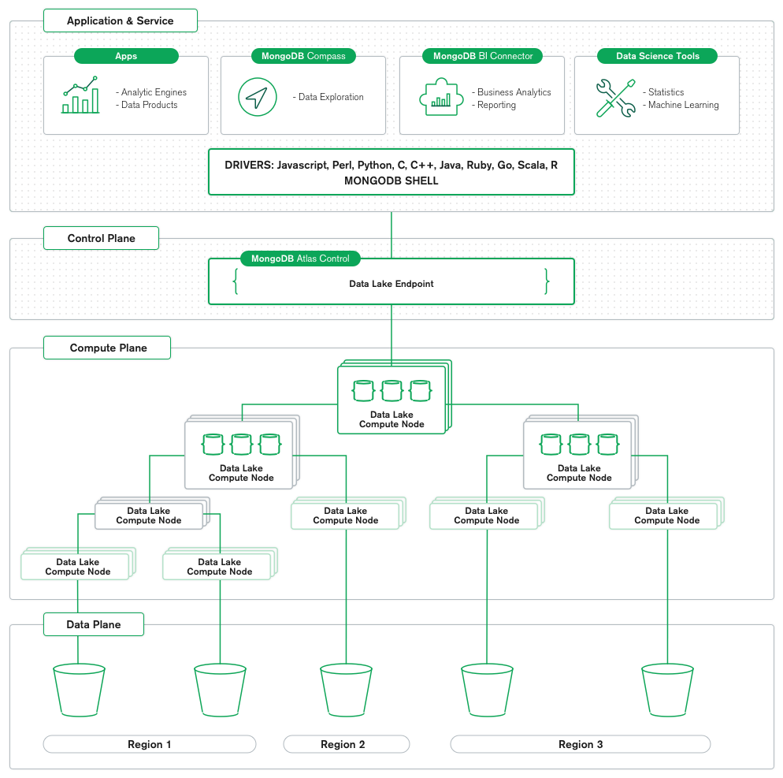

+++
title = "MongoDB: an Introduction"
date = 2020-03-05T01:00:06+00:00
updated = 2020-04-08T17:38:22+00:00
+++

This is the first post in the MongoDB series, where we will introduce the MongoDB database system and take a look at its features and installation methods.

Other posts in this series:

* [MongoDB: an Introduction](/blog/ribw/mongodb-an-introduction/) (this post)
* [MongoDB: Basic Operations and Architecture](/blog/ribw/mongodb-basic-operations-and-architecture/)
* [Developing a Python application for MongoDB](/blog/ribw/developing-a-python-application-for-mongodb/)

This post is co-authored with Classmate.

----------


## Purpose of technology

MongoDB is a **general purpose, document-based, distributed database** built for modern application developers and for the cloud era, with the scalability and flexibility that you want with the querying and indexing that you need. It being a document database means it stores data in JSON-like documents.

The Mongo team believes this is the most natural way to think about data, which is (they claim) much more expressive and powerful than the traditional row/column model, since programmers think in objects.

## How it works

MongoDB’s architecture can be summarized as follows:

* Document data model.
* Distributed systems design.
* Unified experience with freedom to run it anywhere.

For a more in-depth explanation, MongoDB offers a [download to the MongoDB Architecture Guide](https://www.mongodb.com/collateral/mongodb-architecture-guide) with roughly ten pages worth of text.


_ Overview of MongoDB’s architecture_

Regarding usage, MongoDB comes with a really nice introduction along with JavaScript, Python, Java, C++ or C# code at our choice, which describes the steps necessary to make it work. Below we will describe a common workflow.

First, we must **connect** to a running MongoDB instance. Once the connection succeeds, we can access individual «collections», which we can think of as _tables_ where collections of data is stored.

For instance, we could **insert** an arbitrary JSON document into the `restaurants` collection to store information about a restaurant.

At any other point in time, we can **query** these collections. The queries range from trivial, empty ones (which would retrieve all the documents and fields) to more rich and complex queries (for instance, using AND and OR operators, checking if data exists, and then looking for a value in a list).

MongoDB also supports the creation of **indices**, similar to those in other database systems. It allows for the creation of indices on any field or subfields.

In Mongo, the **aggregation pipeline** allows us to filter and analyze data based on a given set of criteria. For example, we could pull all the documents in the `restaurants` collection that have a `category` of `Bakery` using the `$match` operator. Then, we can group them by their star rating using the `$group` operator. Using the accumulator operator, `$sum`, we can see how many bakeries in our collection have each star rating.

## Features

The features can be seen all over the place in their site, because it’s something they make a lot of emphasis on:

* **Easy development**, thanks to the document data model, something they claim to be «the best way to work with data».
* Data is stored in flexible JSON-like documents.
* This model directly maps to the objects in the application’s code.
* Ad hoc queries, indexing, and real time aggregation provide powerful ways to access and analyze the data.

* **Powerful query language**, with a rich and expressive query language that allows filtering and sorting by any field, no matter how nested it may be within a document. The queries are themselves JSON, and thus easily composable.
* **Support for aggregations** and other modern use-cases such as geo-based search, graph search, and text search.
* **A distributed systems design**, which allows developers to intelligently put data where they want it. High availability, horizontal scaling, and geographic distribution are built in and easy to use.
* **A unified experience** with the freedom to run anywhere, which allows developers to future-proof their work and eliminate vendor lock-in.

## Corner in CAP theorem

MongoDB’s position in the CAP theorem (Consistency, Availability, Partition Tolerance) depends on the database and driver configurations, and the type of disaster.

* With **no partitions**, the main focus is **CA**.
* If there are **partitions **but the system is **strongly connected**, the main focus is **AP**: non-synchronized writes from the old primary are ignored.
* If there are **partitions** but the system is **not strongly connected**, the main focus is **CP**: only read access is provided to avoid inconsistencies.
The general consensus seems to be that Mongo is **CP**.

## Download

We will be using the apt-based installation.

The Community version can be downloaded by anyone through [MongoDB Download Center](https://www.mongodb.com/download-center/community), where one can choose the version, Operating System and Package.MongoDB also seems to be [available in Ubuntu’s PPAs](https://packages.ubuntu.com/eoan/mongodb).

## Installation

We will be using an Ubuntu-based system, with apt available. To install MongoDB, we open a terminal and run the following command:

```
apt install mongodb
```

After confirming that we do indeed want to install the package, we should be able to run the following command to verify that the installation was successful:

```
mongod --version
```

The output should be similar to the following:

```
db version v4.0.16
git version: 2a5433168a53044cb6b4fa8083e4cfd7ba142221
OpenSSL version: OpenSSL 1.1.1  11 Sep 2018
allocator: tcmalloc
modules: none
build environment:
	distmod: ubuntu1804
	distarch: x86_64
	target_arch: x86_64
```

## References

* [MongoDB’s official site](https://www.mongodb.com/)
* [What is MongoDB?](https://www.mongodb.com/what-is-mongodb)
* [MongoDB Architecture](https://www.mongodb.com/mongodb-architecture)
* [Where does mongodb stand in the CAP theorem?](https://stackoverflow.com/q/11292215/4759433)
* [What is the CAP Theorem? MongoDB vs Cassandra vs RDBMS, where do they stand in the CAP theorem?](https://medium.com/@bikas.katwal10/mongodb-vs-cassandra-vs-rdbms-where-do-they-stand-in-the-cap-theorem-1bae779a7a15)
* [Why doesn’t MongoDB have availability in the CAP theorem?](https://www.quora.com/Why-doesnt-MongoDB-have-availability-in-the-CAP-theorem)
* [Install MongoDB](https://docs.mongodb.com/manual/installation/)
