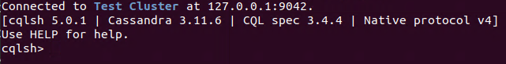
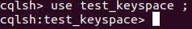
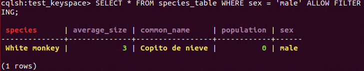
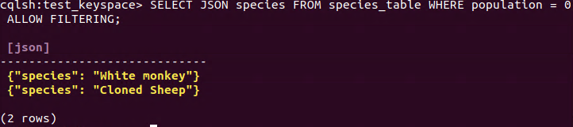
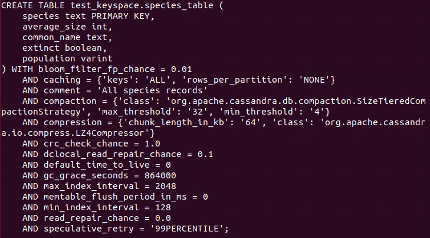
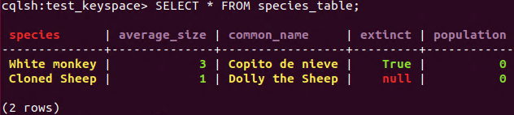
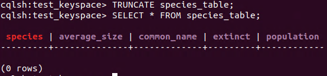
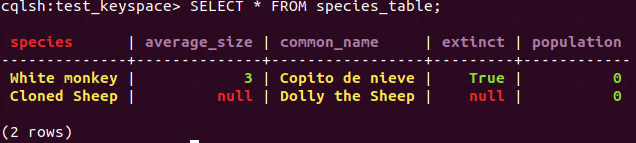
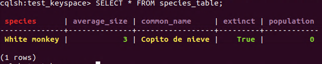
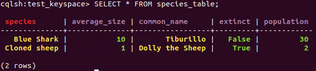

```meta
title: Cassandra: Basic Operations and Architecture
published: 2020-03-05T02:00:36+00:00
updated: 2020-03-24T17:57:05+00:00
```

This is the second post in the NoSQL Databases series, with a brief description on the basic operations (such as insertion, retrieval, indexing…), and complete execution along with the data model / architecture.

Other posts in this series:

* [Cassandra: an Introduction](/blog/ribw/nosql-databases-an-introduction/)
* [Cassandra: Basic Operations and Architecture](/blog/ribw/nosql-databases-basic-operations-and-architecture/) (this post)

----------

Cassandra uses it own Query Language for managing the databases, it is known as **CQL **(**Cassandra Query Language**). Cassandra stores data in **_tables_**, as in relational databases, and these tables are grouped in **_keyspaces_**. A keyspace defines a number of options that applies to all the tables it contains. The most used option is the **replication strategy. **It is recommended to have only one keyspace by application.

It is important to mention that **tables and keyspaces** are** case insensitive**, so myTable is equivalent to mytable, but it is possible to **force case sensitivity** using **double-quotes**.

To begin with the basic operations it is necessary to deploy Cassandra:

1. Open a terminal in the root of the Apache Cassandra folder downloaded in the previous post.
2. Run the command:

```
$ bin/cassandra
```

Once Cassandra is deployed, it is time to open a** CQL Shell**, in **other terminal**, with the command: 

```
$ bin/cqlsh
```

It is possible to check if Cassandra is deployed if the SQL Shell prints the next message:


_CQL Shell_

## Create/Insert 

### DDL (Data Definition Language) 

#### Create keyspace 

A keyspace is created using a **CREATE KEYSPACE **statement:

```
$ **CREATE** KEYSPACE [ **IF** **NOT** **EXISTS** ] keyspace_name **WITH** options;
```

The supported “**options**” are:

* “**replication**”: this is **mandatory **and defines the **replication strategy** and the **replication factor** (the number of nodes that will have a copy of the data). Within this option there is a property called “**class**” in which the **replication strategy** is specified (“SimpleStrategy” or “NetworkTopologyStrategy”)
* “**durable_writes**”: this is **not mandatory** and it is possible to use the **commit logs for updates**.
Attempting to create an already existing keyspace will return an error unless the **IF NOT EXISTS **directive is used. 

The example associated to this statement is create a keyspace with name “test_keyspace” with “SimpleStrategy” as “class” of replication and a “replication_factor” of 3.

```
**CREATE** KEYSPACE test_keyspace
    **WITH** **replication** = {'class': 'SimpleStrategy',
                        'replication_factor' : 3};
```

The **USE **statement allows to **change** the current **keyspace**. The syntax of this statement is very simple: 

```
**USE** keyspace_name;
```


_USE statement_

It is also possible to get the metadata from a keyspace with the **DESCRIBE **statement.

```
**DESCRIBE** KEYSPACES | KEYSPACE keyspace_name;
```

#### Create table 

Creating a new table uses the **CREATE TABLE **statement:

```
**CREATE** **TABLE** [ **IF** **NOT** **EXISTS** ] table_name
    '('
        column_definition
        ( ',' column_definition )*
        [ ',' **PRIMARY** **KEY** '(' primary_key ')' ]
    ')' [ **WITH** table_options ];
```

With “column_definition” as: column_name cql_type [ STATIC ] [ PRIMARY KEY]; “primary_key” as: partition_key [ ‘,’ clustering_columns ]; and “table_options” as: COMPACT STORAGE [ AND table_options ] or CLUSTERING ORDER BY ‘(‘ clustering_order ‘)’ [ AND table_options ] or “options”.

Attempting to create an already existing table will return an error unless the **IF NOT EXISTS** directive is used.

The **CQL types** are described in the References section.

For example, we are going to create a table called “species_table” in the keyspace “test_keyspace” in which we will have a “species” text (as PRIMARY KEY), a “common_name” text, a “population” varint, a “average_size” int and a “sex” text. Besides, we are going to add a comment to the table: “Some species records”;

```
**CREATE** **TABLE** species_table (
    species text **PRIMARY** **KEY**,
    common_name text,
    population varint,
    average_size **int**,
    sex text,
) **WITH** **comment**='Some species records';
```

It is also possible to get the metadata from a table with the **DESCRIBE **statement.

```
**DESCRIBE** **TABLES** | **TABLE** [keyspace_name.]table_name;
```

### DML (Data Manipulation Language)

#### Insert data

Inserting data for a row is done using an **INSERT **statement:

```
**INSERT** **INTO** table_name ( names_values | json_clause )
                      [ **IF** **NOT** **EXISTS** ]
                      [ **USING** update_parameter ( **AND** update_parameter )* ];
```

Where “names_values” is: names VALUES tuple_literal; “json_clause” is: JSON string [ DEFAULT ( NULL | UNSET ) ]; and “update_parameter” is usually: TTL.

For example we are going to use both VALUES and JSON clauses to insert data in the table “species_table”. In the VALUES clause it is necessary to supply the list of columns, not as in the JSON clause that is optional.

Note: TTL (Time To Live) and Timestamp are metrics for expiring data, so, when the time set is passed, the operation is expired.

In the VALUES clause we are going to insert a new specie called “White monkey”, with an average size of 3, its common name is “Copito de nieve”, population 0 and sex “male”.

```
**INSERT** **INTO** species_table (species, common_name, population, average_size, sex)
                **VALUES** ('White monkey', 'Copito de nieve', 0, 3, 'male');
```

In the JSON clause we are going to insert a new specie called “Cloned sheep”, with an average size of 1, its common name is “Dolly the sheep”, population 0 and sex “female”.

```
**INSERT** **INTO** species_table JSON '{"species": "Cloned Sheep",
                              "common_name": "Dolly the Sheep",
                              "average_size":1,
                              "population":0,
                              "sex": "female"}';
```

Note: all updates for an **INSERT **are applied **atomically **and in **isolation.**

## Read

Querying data from data is done using a **SELECT **statement:

```
**SELECT** [ JSON | **DISTINCT** ] ( select_clause | '*' )
                      **FROM** table_name
                      [ **WHERE** where_clause ]
                      [ **GROUP** **BY** group_by_clause ]
                      [ **ORDER** **BY** ordering_clause ]
                      [ PER **PARTITION** **LIMIT** (**integer** | bind_marker) ]
                      [ **LIMIT** (**integer** | bind_marker) ]
                      [ ALLOW FILTERING ];
```

The **CQL SELECT **statement is very **similar **to the **SQL SELECT **statement due to the fact that both allows filtering (**WHERE**), grouping data (**GROUP BY**), ordering the data (**ORDER BY**) and limit the number of data (**LIMIT**). Besides, **CQL offers **a **limit per partition **and allow the **filtering **of **data**.

Note: as in SQL it it possible to set alias to the data with the statement **AS.**

For example we are going to retrieve all the information about those values from the tables “species_table” which “sex” is “male”. Allow filtering is mandatory when there is a WHERE statement.

```
**SELECT** * **FROM** species_table **WHERE** sex = 'male' ALLOW FILTERING;
```


_SELECT statement_

Furthermore, we are going to test the SELECT JSON statement. For this, we are going to retrieve only the species name with a population of 0. 

```
**SELECT** JSON species **FROM** species_table **WHERE** population = 0 ALLOW FILTERING;
```


_SELECT JSON statement_

## Update 

### DDL (Data Definition Language)

#### Alter keyspace 

The statement **ALTER KEYSPACE **allows to modify the options of a keyspace:

```
**ALTER** KEYSPACE keyspace_name **WITH** options;
```

Note: the supported **options **are the same than for creating a keyspace, “**replication**” and “**durable_writes**”.

The example associated to this statement is to modify the keyspace with name “test_keyspace” and set a “replication_factor” of 4.

```
**ALTER** KEYSPACE test_keyspace
    **WITH** **replication** = {'class': 'SimpleStrategy', 'replication_factor' : 4};
```

#### Alter table

Altering an existing table uses the **ALTER TABLE **statement:

```
**ALTER** **TABLE** table_name alter_table_instruction;
```

Where “alter_table_instruction” can be: ADD column_name cql_type ( ‘,’ column_name cql_type )*; or DROP column_name ( column_name )*; or WITH options

The example associated to this statement is to ADD a new column to the table “species_table”, called “extinct” with type “boolean”.

```
**ALTER** **TABLE** species_table **ADD** extinct **boolean**;
```

Another example is to DROP the column called “sex” from the table “species_table”.

```
**ALTER** **TABLE** species_table **DROP** sex;
```

 Finally, alter the comment with the WITH clause and set the comment to “All species records”. 

```
**ALTER** **TABLE** species_table **WITH** **comment**='All species records';
```

These changes can be checked with the **DESCRIBE **statement:

```
**DESCRIBE** **TABLE** species_table;
```


_DESCRIBE table_

### DML (Data Manipulation Language)

#### Update data

Updating a row is done using an **UPDATE **statement:

```
**UPDATE** table_name
[ **USING** update_parameter ( **AND** update_parameter )* ]
**SET** assignment ( ',' assignment )*
**WHERE** where_clause
[ **IF** ( **EXISTS** | condition ( **AND** condition )*) ];
```

Where the update_parameter is: ( TIMESTAMP | TTL) (integer | bind_marker)

It is important to mention that the **WHERE **clause is used to select the row to update and **must **include ** all columns** composing the **PRIMARY KEY.**

We are going to test this statement updating the column “extinct” to true to the column with name ‘White monkey’.

```
**UPDATE** species_table **SET** extinct = **true** **WHERE** species='White monkey';
```


_SELECT statement_

## Delete

### DDL (Data Definition Language)

#### Drop keyspace

Dropping a keyspace can be done using the **DROP KEYSPACE **statement:

```
**DROP** KEYSPACE [ **IF** **EXISTS** ] keyspace_name;
```

For example, drop the keyspace called “test_keyspace_2” if it exists:

```
**DROP** KEYSPACE **IF** **EXISTS** test_keyspace_2;
```

As this keyspace does not exists, this sentence will do nothing.

#### Drop table

Dropping a table uses the **DROP TABLE **statement:

```
**DROP** **TABLE** [ **IF** **EXISTS** ] table_name;
```

 For example, drop the table called “species_2” if it exists: 

```
**DROP** **TABLE** **IF** **EXISTS** species_2;
```

As this table does not exists, this sentence will do nothing.

#### Truncate (table)

A table can be truncated using the **TRUNCATE **statement:

```
**TRUNCATE** [ **TABLE** ] table_name;
```

Do not execute this command now, because if you do it, you will need to insert the previous data again.

Note: as tables are the only object that can be truncated the keyword TABLE can be omitted.


_TRUNCATE statement_

### DML (Data Manipulation Language)

#### Delete data

Deleting rows or parts of rows uses the **DELETE **statement:

```
**DELETE** [ simple_selection ( ',' simple_selection ) ]
                      **FROM** table_name
                      [ **USING** update_parameter ( **AND** update_parameter )* ]
                      **WHERE** where_clause
                      [ **IF** ( **EXISTS** | condition ( **AND** condition )*) ]
```

Now we are going to delete the value of the column “average_size” from “Cloned Sheep”. 

```
**DELETE** average_size **FROM** species_table **WHERE** species = 'Cloned Sheep';
```


_DELETE value statement_

And we are going to delete the same row as mentioned before. 

```
**DELETE** **FROM** species_table **WHERE** species = 'Cloned Sheep';
```


_DELETE row statement_

## Batch

Multiple **INSERT**, **UPDATE **and **DELETE **can be executed in a **single statement** by grouping them through a **BATCH **statement.

```
**BEGIN** [ UNLOGGED | COUNTER ] BATCH
                            [ **USING** update_parameter ( **AND** update_parameter )* ]
                            modification_statement ( ';' modification_statement )*
                            APPLY BATCH;
```

Where modification_statement can be a insert_statement or an update_statement or a delete_statement.

* **UNLOGGED **means that either all operations in a batch eventually complete or none will.
* **COUNTER** means that the updates are not idempotent, so each time we execute the updates in a batch, we will have different results.
For example:

```
**BEGIN** BATCH
   **INSERT** **INTO** species_table (species, common_name, population, average_size, extinct)
                **VALUES** ('Blue Shark', 'Tiburillo', 30, 10, **false**);
   **INSERT** **INTO** species_table (species, common_name, population, average_size, extinct)
                **VALUES** ('Cloned sheep', 'Dolly the Sheep', 1, 1, **true**);
   **UPDATE** species_table **SET** population = 2 **WHERE** species='Cloned sheep';
   **DELETE** **FROM** species_table **WHERE** species =  'White monkey';
APPLY BATCH;
```


_BATCH statement_

## Index

CQL support creating secondary indexes on tables, allowing queries on the table to use those indexes. 

**Creating **a secondary index on a table uses the **CREATE INDEX **statement:

```
**CREATE** [ CUSTOM ] **INDEX** [ **IF** **NOT** **EXISTS** ] [ index_name ]
                                **ON** table_name '(' index_identifier ')'
                                [ **USING** string [ **WITH** OPTIONS = map_literal ] ];
```

For example we are going to create a index called “population_idx” that is related to the column “population” in the table “species_table”.

```
**CREATE** **INDEX** population_idx **ON** species_table (population);
```

**Dropping **a secondary index uses the **DROP INDEX** statement: 

```
**DROP** **INDEX** [ **IF** **EXISTS** ] index_name;
```

Now, we are going to drop the previous index: 

```
**DROP** **INDEX** **IF** **EXISTS** population_idx;
```

## References

* [Cassandra CQL](https://cassandra.apache.org/doc/latest/cql/ddl.html)
* [Differences between DML and DDL](https://techdifferences.com/difference-between-ddl-and-dml-in-dbms.html)
* [Datastax CQL](https://docs.datastax.com/en/dse/5.1/cql/cql/cql_reference/cqlReferenceTOC.html)
* [Cassandra CQL Types](https://cassandra.apache.org/doc/latest/cql/types.html#grammar-token-cql-type)
* [Cassandra Index](https://cassandra.apache.org/doc/latest/cql/indexes.html)
