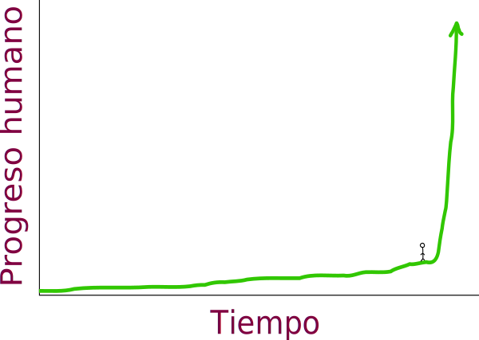
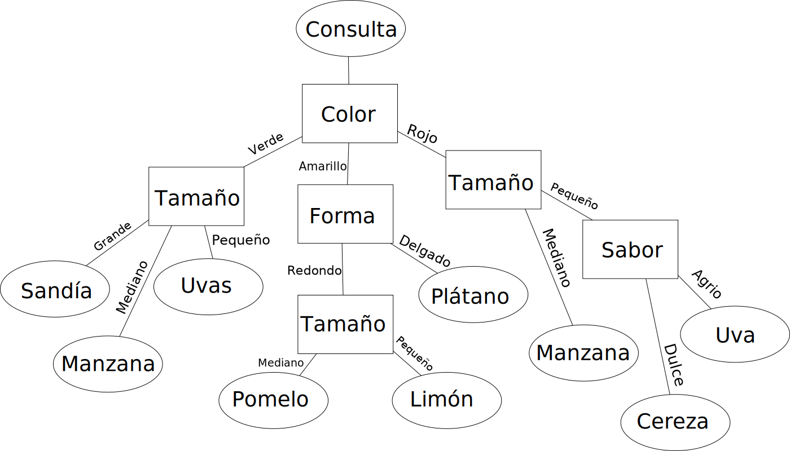

+++
title = "Inteligencia artificial"
date = 2016-02-24
updated = 2016-03-05
+++

Índice
------

* [Qué es](#que-es)
* [En qué consiste](#en-que-consiste)
* [Límites](#limites)
* [Tipos de inteligencia artificial](#tipos-de-inteligencia-artificial)
* [Aplicaciones prácticas](#aplicaciones-practicas)
* [Implicaciones éticas](#implicaciones-eticas)
* [Ejemplos](#ejemplos)
* [Conceptos](#conceptos)
* [Fuentes](#fuentes)

Qué es
------

La inteligencia artificial es una rama apasionante que tiene su origen en la **informática** y se basa en el concepto de conseguir *emular*[^1] al cerebro humano, mediante el desarrollo un programa que sea capaz de **aprender y mejorar por sí sólo** (normalmente bajo algún tipo de supervisión)

Fue un concepto acuñado por *John McCarthy* en un congreso de informática de 1956, y desde entonces este campo ha crecido de manera exponencial con unas buenas previsiones de futuro.

*Progreso humano en la inteligencia artificial. [Fuente](http://waitbutwhy.com/2015/01/artificial-intelligence-revolution-1)*

En qué consiste
---------------

La inteligencia artificial no consiste en escribir unas pautas fijas y finitas al igual que hacen la gran mayoría de programas, en los cuales introduces unos datos y producen siempre la misma salida, una salida predecible, programada e invariable, que además, tiene sus límites, ya que si introduces datos para los que la aplicación no está programada, esta aplicación no será capaz de manejarlos. No los entenderá y no producirá ningún resultado.

La inteligencia artificial consiste en dar un paso **más allá**. Una inteligencia artificial *entrenada* es capaz de manejar datos para los cuales no ha sido programada de manera explícita[^2]

Límites
-------

Actualmente, la inteligencia artificial se ve limitada por la velocidad y capacidad de los dispositivos (ordenadores, teléfonos inteligentes).

A día de hoy, ya hemos conseguido emular el cerebro de un gusano de un milímetro de longitud, que consiste de un total de trescientas dos neuronas. El **cerebro humano** contiene unas **cien mil millones de neuronas**.

*Crecimiento en la velocidad de procesado de los dispositivos. [Fuente](http://waitbutwhy.com/2015/01/artificial-intelligence-revolution-1)*

Comparado con las neuronas de un cerebro humano (cuya velocidad[^3] máxima oscilan entre los 200Hz), los procesadores de hoy en día (mucho más lentos que los que tendremos dentro de algunos años) ya tienen una velocidad superior a los 2Ghz, es decir, **10 millones de veces** más rápidos que las neuronas. Y la comunicación interna del cerebro, que oscila entre los 120m/s, queda infinitamente distante de la velocidad de los ordenadores que se comunican de manera óptica a la **velocidad de la luz**.

Además de todo esto, la capacidad de los dispositivos puede ser **ampliada**, a diferencia del cerebro que tiene un tamaño ya determinado. Y, por último, un procesador puede estar **trabajando sin parar** nunca, sin cansarse.

<!-- Boston dynamics artificial intelligence put some more examples, like Google or predicting models or big data, ocr -->

Tipos de inteligencia artificial
--------------------------------

### Según el tipo de aprendizaje

* **Aprendizaje supervisado**: se le presenta una entrada de datos y produce una salida de los datos procesados, y un "tutor" es el que determina si la salida es correcta o no.
* **Aprendizaje sin supervisar**: se le presenta una entrada de datos sin presentarle ningún otro tipo de información, para que encuentre la estructura de los datos por sí sóla.
* **Aprendizaje por refuerzo**: un ordenador interactua con un entorno variable en el que debe llevar a cabo una tarea concreta, sin que un tutor le indique cómo explícitamente.

### Según la forma de llevarlo a cabo (principales métodos)

* **Aprendizaje por árbol de decisiones**. Este aprendizaje usa un árbol de decisiones, que almacena observaciones y conclusiones.

  

* **Aprendizaje por asociación de reglas**. Utilizado para descubrir relaciones en grandes bases de datos[^4].

* **Red neuronal artificial (RNA)**. Inspirado en redes neuronales biológicas**. Los cálculos se estructuran en un grupo de neuronas artificiales interconectadas.

* **Programación lógica inductiva (PLI)**. Se aproxima de manera hipotética, dado un transfondo lógico y una entrada, a una solución que no se le había presentado antes.

* **Máquinas de soporte vectorial (MSV)**. Se usan para clasificar y problemas que necesitan de regresión[^5]. Dado una serie de ejemplos, una entrada será clasificada de una forma u otra.

* ***Clustering***. Este tipo de análisis consiste en asignar observaciones a ciertas subcategorías (denominadas *clústeres*), para que aquellas que están en el mismo *clúster* sean similares**. Este tipo de aprendizaje es una técnica común en análisis estadístico.

* **Redes bayesianas**. Es un modelo probabilístico que organiza variables al azar según unas determinadas condiciones mediante un gráfico**. Un ejemplo de red bayesiana es el siguiente:

  

* **Algoritmos genéticos**. Imita el proceso evolutivo de la selección natural, y usa métodos como la mutación para generar nuevos "genotipos" que, con algo de suerte, serán mejores en encontrar la solución correcta.

Aplicaciones prácticas
----------------------

La inteligencia artificial ya se encuentra desde hace algún tiempo entre nosotros, como por ejemplo el archiconocido **buscador Google**, que filtra los resultados más relevantes mediante una inteligencia artificial. Otros ejemplos son el reconocimiento de caracteres a partir de una foto, o incluso reconocimiento del habla con **asistentes virtuales como Cortana o Siri**, en los videojuegos, en bolsa, en los **hospitales**, industria pesada, transportes, juguetes, música, aviación, robótica, filtros anti-spam... y un largo etcétera.

Implicaciones éticas
--------------------

Una vez tengamos la tecnología necesaria para recrear un cerebro humano, si enseñáramos a esta inteligencia artificial al igual que un humano, ¿llegaría a tener **sentimientos**? ¿Sería consciente de su existencia? ¿Podría sentir felicidad, alegría, tristeza, enfado? ¿Tendría **creatividad**? ¿Derecho a propiedad? Si la respuesta es que sí, y es la respuesta más lógica, significa que, en realidad, los sentimientos no son nada más que una manera de entender las cosas. No tienen valor por sí mismos. Seríamos capaces de recrearlos, y tendrían el mismo valor que un sentimiento humano, aunque esa inteligencia viviera dentro de un ordenador. Y acabar con esta inteligencia sería acabar con esta vida, **una vida** casi, por no decir enteramente, **humana**. Además, todo esto implicaría que todo comportamiento humano es predecible. Por último, si esta inteligencia es realmente como un humano, al utilizarla, ¿la estaríamos esclavizando al obligarla a trabajar para nosotros? ¿En qué momento dejaremos de llamarlos "ordenadores" y comenzaremos a tratarles como "humanos"? ¿Será la humanidad capaz de adaptarse al cambio?

<!-- ¿y si sólo somos cerebro y logramos recrearlo? ¿tendría sentimientos? -->

Ejemplos
--------

En el siguiente algorítmo genético podemos ver como una figura aprende a saltar, obedeciendo a las leyes físicas (ver en [YouTube](https://youtu.be/Gl3EjiVlz_4)):

<iframe width="420" height="315" src="https://www.youtube.com/embed/Gl3EjiVlz_4" frameborder="0" allowfullscreen></iframe>

Por el contrario, en el siguiente ejemplo, un algorítmo genético aprende a "luchar" contra otra figura: (ver en [YouTube](https://youtu.be/u2t77mQmJiY)):

<iframe width="560" height="315" src="https://www.youtube.com/embed/u2t77mQmJiY" frameborder="0" allowfullscreen></iframe>

Estos cuatro increíbles ejemplos siguientes muestran un proceso evolutivo similar al sufrido por cualquier tipo de ser (ver en [YouTube](https://youtu.be/GOFws_hhZs8)):

<iframe width="560" height="315" src="https://www.youtube.com/embed/GOFws_hhZs8" frameborder="0" allowfullscreen></iframe>
<iframe width="560" height="315" src="https://www.youtube.com/embed/31dsH2Fs1IQ" frameborder="0" allowfullscreen></iframe>
<iframe width="560" height="315" src="https://www.youtube.com/embed/IVcvvqxtNwE" frameborder="0" allowfullscreen></iframe>
<iframe width="560" height="315" src="https://www.youtube.com/embed/KrTbJUJsDSw" frameborder="0" allowfullscreen></iframe>

Conceptos
---------

[^1]: **Emular**. Tratar de imitar un modelo, aproximarse a este. Copiar su comportamiento o incluso mejorarlo.

[^2]: **Explícito**. Suceso que ocurre de manera previamente avisada de una forma directa, anticipado *sin rodeos*.

[^3]: **Velocidad (en hercios)**. Número de cálculos realizados por segundo. Un procesador con una velocidad de 100Hz es capaz de realizar 100 cálculos por segundo.

[^4]: **Base de datos**. Lugar en el que se almacena de manera estructurada una información, como por ejemplo un censo que indique el nombre de las personas, sus apellidos, edad, etcétera.

[^5]: **Regresión**. Las pruebas de regresión consisten en someter a un programa a una serie de pruebas para descubrir fallos en este cometidos accidentalmente con anterioridad en versiones anteriores.

Fuentes
-------

* [Evolución de la inteligencia artificial - Wait but why](http://waitbutwhy.com/2015/01/artificial-intelligence-revolution-1)
* [*Machine learning* - Wikipedia](https://en.wikipedia.org/wiki/Machine_learning)
